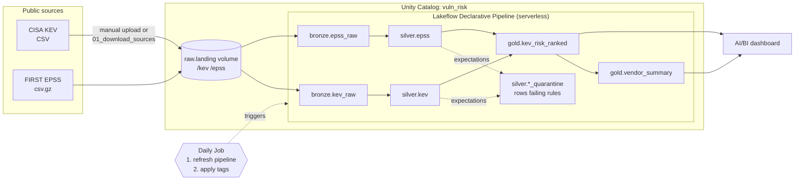

# vuln-risk-lakehouse

[](https://github.com/yjang1101/Databricks-Project/actions/workflows/ci.yml)

A small, end-to-end **Databricks lakehouse** that answers a real security question:
*of all vulnerabilities known to be exploited in the wild, which should we patch first?*

It combines two free public datasets:

| Source | What it tells us | Format |
|---|---|---|
| [CISA Known Exploited Vulnerabilities (KEV)](https://www.cisa.gov/known-exploited-vulnerabilities-catalog) | CVEs confirmed exploited in the wild, with remediation due dates and ransomware use | CSV, 12 columns |
| [FIRST.org EPSS](https://www.first.org/epss/) | Daily probability (0–1) that a CVE is exploited in the next 30 days | gzipped CSV with a `#model_version…,score_date…` comment line |

Built for **Databricks Free Edition** (serverless only): Unity Catalog, Lakeflow Declarative Pipelines
(formerly Delta Live Tables) with data-quality expectations, a scheduled Job, governance comments and
tags, an AI/BI dashboard, a Databricks bundle, and PySpark unit tests running in GitHub Actions.

## Architecture



| Layer | Tables | What happens |
|---|---|---|
| **Bronze** | `kev_raw`, `epss_raw` | Files loaded as-is (all strings) + `_source_file`, `_file_modified_at`, `_ingested_at`. EPSS also keeps `_model_version` / `_score_date` from its comment line. |
| **Silver** | `kev`, `epss`, `kev_quarantine`, `epss_quarantine` | Typed dates/doubles/booleans, snake_case names, CVE IDs normalized (trim, upper-case, Unicode dashes), one row per CVE (latest snapshot wins), expectations applied. |
| **Gold** | `kev_risk_ranked`, `vendor_summary` | KEV + EPSS joined and ranked; per-vendor rollup. Every table and column has a comment; key columns are tagged. |

## Repository layout

```
├── databricks.yml                  # bundle: variables + target
├── resources/
│   ├── vuln_risk.pipeline.yml      # Lakeflow pipeline (serverless)
│   └── vuln_risk.job.yml           # daily job: pipeline -> governance tags
├── src/
│   ├── vuln_risk/                  # plain PySpark logic (unit-tested, no Databricks APIs)
│   │   ├── config.py               # settings + data-quality rules (single source of truth)
│   │   └── transforms.py           # read / clean / dedupe / quality / gold functions
│   └── pipeline/                   # thin Lakeflow wrappers around vuln_risk
│       ├── bronze.py
│       ├── silver.py
│       └── gold.py
├── notebooks/
│   ├── 00_setup_unity_catalog.sql  # catalog, schemas, volume
│   ├── 01_download_sources.py      # optional: download files if internet access works
│   └── 02_apply_governance.py      # column/table tags (run by the job)
├── dashboards/dashboard_queries.sql
├── tests/                          # pytest with small fake KEV/EPSS files
└── .github/workflows/ci.yml        # ruff + pytest on every push
```

## Setup on Databricks Free Edition

**1. Create a workspace.** Sign up for [Databricks Free Edition](https://www.databricks.com/learn/free-edition).

**2. Add this repo as a Git folder.** *Workspace → Create → Git folder* → paste the repo URL → *Create Git folder*.
(Public repos clone without credentials. To commit from Databricks, link GitHub under *Settings → Linked accounts*.)

**3. Create the catalog, schemas and volume.** Open `notebooks/00_setup_unity_catalog.sql`, attach serverless compute, *Run all*.
If `CREATE CATALOG` is refused, create the catalog in *Catalog → + → Create catalog* (default storage) and re-run,
or use the built-in `workspace` catalog (see the notebook's note and set the bundle variable `catalog: workspace`).

**4. Load the source files.** Free Edition restricts outbound internet, so the default is a manual upload:

1. Download the [KEV CSV](https://www.cisa.gov/sites/default/files/csv/known_exploited_vulnerabilities.csv)
   and the [EPSS file](https://epss.empiricalsecurity.com/epss_scores-current.csv.gz) (keep it gzipped).
2. *Catalog → vuln_risk → raw → landing* → *Create directory* `kev` and `epss`.
3. Upload the KEV CSV into `kev/` and the `.csv.gz` into `epss/`. Adding a date to the file name
   (e.g. `known_exploited_vulnerabilities_2026-10-07.csv`) keeps snapshots apart; silver always uses the latest.

*Optional:* run `notebooks/01_download_sources.py` instead. It downloads both files into the volume and fails with a clear message if the domains are blocked.

**5. Deploy the pipeline and job.** Either option works.

*Option A – bundle (recommended):* in the Git folder open `databricks.yml` → click the **Deployments** (🚀) icon → target `free` → **Deploy**.
This creates `vuln-risk-lakehouse-pipeline` and `vuln-risk-lakehouse-daily`. To use a different catalog or landing path, change the `variables` defaults in `databricks.yml` first.
(CLI equivalent: `databricks bundle deploy`.)

*Option B – manual:*
1. *Jobs & Pipelines → Create → ETL pipeline*. Name `vuln-risk-lakehouse-pipeline`; default catalog `vuln_risk`, schema `bronze`; serverless.
2. Set the pipeline **root folder** to `<your Git folder>/src` and add the source files `src/pipeline/bronze.py`, `silver.py`, `gold.py`.
3. *Settings → Configuration* → add `vuln_risk.catalog = vuln_risk` and `vuln_risk.landing_path = /Volumes/vuln_risk/raw/landing`.
4. *Jobs & Pipelines → Create → Job*: task `refresh_pipeline` (type *Pipeline*, select the pipeline) → task `apply_governance_tags` (type *Notebook*, `notebooks/02_apply_governance.py`, parameter `catalog = vuln_risk`, depends on `refresh_pipeline`) → *Schedules & Triggers* → daily.

**6. Run it.** *Jobs & Pipelines → vuln-risk-lakehouse-daily → Run now*. Open the pipeline to see the graph and the **Data quality** tab (expectation pass/fail counts per rule).
Then check `SELECT * FROM vuln_risk.gold.kev_risk_ranked ORDER BY risk_rank LIMIT 20`.

**7. Build the dashboard.** *Dashboards → Create dashboard* → **Data** tab → *Create from SQL* → add one dataset per query in
[`dashboards/dashboard_queries.sql`](dashboards/dashboard_queries.sql) (`kpi_overview`, `top_20_riskiest`, `vulns_by_vendor`, `kev_additions_over_time`). On the **Canvas**:

| Widget | Dataset | Settings |
|---|---|---|
| 4 × Counter | `kpi_overview` | `total_kev_cves`, `ransomware_cves`, `past_due_cves`, `high_epss_cves` |
| Table | `top_20_riskiest` | all columns |
| Bar chart | `vulns_by_vendor` | X `vendor_project`, Y `exploited_vuln_count` (+ `ransomware_vuln_count`) |
| Line chart | `kev_additions_over_time` | X `month_added`, Y `cves_added` |

*Publish* the dashboard (it runs on the Free Edition SQL warehouse).

## Screenshots

<!-- Replace these after your first run: save PNGs to docs/images/ -->
| Pipeline graph | Dashboard |
|---|---|
|  |  |

## Run the tests locally

Needs Python 3.10+ and Java 17.

```bash
python -m venv .venv && source .venv/bin/activate
pip install -r requirements-dev.txt
pytest -v
```

The tests build tiny fake KEV/EPSS files (including a gzipped EPSS file with the real comment line, a multi-line
KEV description and deliberately bad rows) and exercise the same functions the pipeline calls: reading, cleaning,
de-duplication, quality rules, gold logic, and a check that gold outputs match the schemas the pipeline declares.

## Design decisions

**Why medallion layers?** Each layer has one job. Bronze is a faithful, replayable copy of what arrived (all strings,
plus file lineage), so a bug in cleaning never requires re-downloading data. Silver is the single trusted, typed
version of each entity. Gold is shaped for one consumer (the dashboard), so business logic like "past due" lives in
one place instead of in every query.

**Why expectations, and why drop + quarantine?** Rules are declared next to the tables, enforced on every run, and
their pass/fail counts show up in the pipeline UI without extra code. I split rules by impact:
- *Drop* (bad CVE ID, missing `dateAdded`, EPSS outside 0–1): a row like that would corrupt joins or rankings, so it
  must not reach gold.
- *Quarantine*: dropped rows are kept in `silver.*_quarantine` with the names of the failed rules, so nothing is lost
  silently and fixes can be replayed.
- *Warn* (missing vendor, due date before added date): the row is still useful, so it is kept and only counted.
- I avoided `expect_or_fail`: one bad upstream row shouldn't stop the daily refresh.

The rules live in one dictionary (`src/vuln_risk/config.py`) used by the expectations, the quarantine tables and the tests.

**Why plain PySpark functions in `src/`?** Pipeline decorators are a thin layer; the logic is ordinary functions that
run with open-source PySpark, so they're unit-tested in CI in seconds without a workspace.

**Why materialized views (not streaming) everywhere?** The data is small (KEV ≈ 1.7k rows, EPSS ≈ 300k rows/day),
so a full recompute is cheap and simple. Gold also depends on "today" (`days_since_added`, `is_past_due`), which is
naturally a recompute.

**Free Edition choices:** serverless pipeline and job tasks only (no clusters); one pipeline (Free Edition allows one
active pipeline per type); manual upload as the default ingest because outbound internet is restricted; tags applied
by a notebook after each refresh because tags can't be declared inside a pipeline definition.

**How I'd scale this in production:**
- **Incremental ingest with Auto Loader:** bronze as streaming tables reading `cloudFiles` from the volume, so each run
  processes only new files, with schema hints and `_rescued_data` for unexpected columns (KEV added `forensicTriage` in 2026).
- **CDC + SCD Type 2:** KEV entries change (ransomware status, due dates, notes). `AUTO CDC` (formerly `APPLY CHANGES`)
  with `stored_as_scd_type=2` would keep full history, e.g. "when did this CVE get linked to ransomware?"
- **EPSS history as a fact table:** append every daily snapshot, liquid-clustered by `score_date`, to trend risk over time
  instead of keeping only the latest score.
- **Environments and CI/CD:** `dev`/`prod` bundle targets, deployment from GitHub Actions with a service principal,
  and the job running as that principal.
- **Operations:** job retries and failure alerts, alerts on expectation failure rates from the pipeline event log,
  and Unity Catalog permissions (e.g. analysts get `SELECT` on `gold` only).

## Data licensing

KEV is published by CISA (US government work). EPSS is provided free by FIRST.org; see their usage guidance and cite
EPSS when publishing results.
